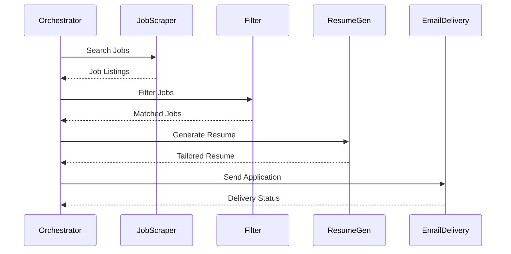

# Project Taylor Architecture

## System Overview

Project Taylor is designed as a microservices-based automated job application system following MCP-first principles. Each service is self-contained, with well-defined interfaces and responsibilities.

## Core Services

### 1. Job Scraper Service

#### Purpose
- Aggregates job listings from multiple sources
- Standardizes job data format
- Provides filtering capabilities

#### Components
- `apify_client.py`: Interfaces with Apify's job scraping actors
- `firecrawl_client.py`: Custom scraping implementation
- MCP-compliant API interface

#### Data Flow
1. Receives search parameters via MCP
2. Fetches data from configured sources
3. Standardizes and validates job data
4. Returns unified job listings

### 2. Filter Service

#### Purpose
- Analyzes job requirements
- Scores job relevance
- Filters based on criteria

#### Components
- `filter_logic.py`: Core matching algorithms
- Scoring system for job relevance
- Requirement analysis engine

#### Matching Algorithm
1. Extracts skills and requirements
2. Compares against criteria
3. Calculates match percentage
4. Ranks opportunities

### 3. Resume Generator Service

#### Purpose
- Customizes resumes for specific jobs
- Handles document formatting
- Provides multiple output formats

#### Components
- `openrouter_client.py`: LLM integration
- `pandoc_client.py`: Document conversion
- Template management system

#### Generation Process
1. Analyzes job requirements
2. Tailors content using LLM
3. Applies formatting
4. Converts to requested format

### 4. Email Delivery Service

#### Purpose
- Manages email composition
- Handles attachments
- Tracks delivery status

#### Components
- `emailer.py`: Email handling logic
- Template system
- Delivery tracking

## Inter-Service Communication

### MCP Protocol

### Data Flow
1. Job data standardization
2. Filtering and matching
3. Resume customization
4. Application delivery

## Shared Components

### Common Utilities
- `mcp_client.py`: MCP implementation
- `logging.py`: Centralized logging
- `utils.py`: Shared functions

### Infrastructure
- Redis for caching
- RabbitMQ for messaging
- Docker for containerization

## Security Considerations

### API Security
- API key validation
- Rate limiting
- Input sanitization

### Data Protection
- Secure credential storage
- Encrypted communication
- Personal data handling

## Scalability

### Horizontal Scaling
- Stateless services
- Container orchestration
- Load balancing

### Performance Optimization
- Caching strategies
- Async operations
- Resource pooling

## Monitoring and Logging

### Metrics
- Request latency
- Success rates
- Resource usage

### Logging
- Structured JSON logs
- Centralized collection
- Error tracking

## Development Workflow

### Local Development
1. Clone repository
2. Configure environment
3. Start required services
4. Run development servers

### Testing
- Unit tests per service
- Integration tests
- MCP compliance tests

### Deployment
1. Build containers
2. Run integration tests
3. Deploy services
4. Monitor health

## Future Enhancements

### Planned Features
- Additional job sources
- Enhanced matching algorithms
- More document formats
- Analytics dashboard

### Potential Improvements
- Machine learning integration
- Real-time notifications
- Interview scheduling
- Application tracking

## Configuration Management

### Environment Variables
- API credentials
- Service endpoints
- Feature flags

### Service Registry
- MCP service discovery
- Endpoint management
- Schema validation

## Error Handling

### Strategies
- Retry mechanisms
- Circuit breakers
- Fallback options

### Recovery
- Automated recovery
- Manual intervention
- Data consistency

## Documentation

### Service Documentation
- API specifications
- Setup guides
- Configuration details

### Developer Guides
- Contributing guidelines
- Code standards
- Testing procedures

## Conclusion

The MCP-first architecture provides a flexible, maintainable system that can be extended with new capabilities while maintaining clear interfaces and responsibilities between services.
